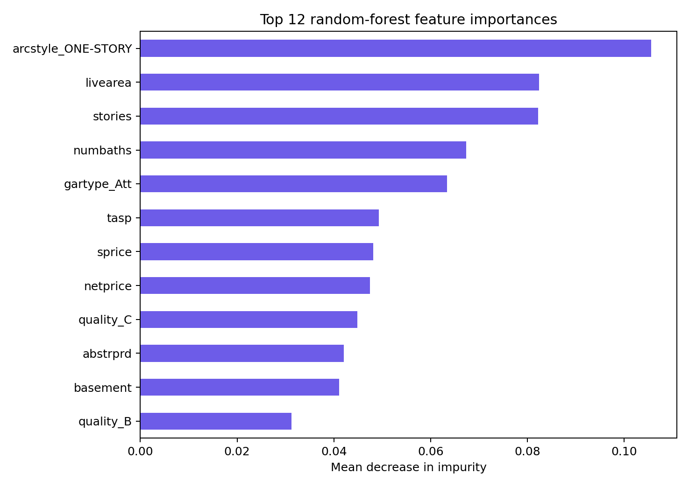
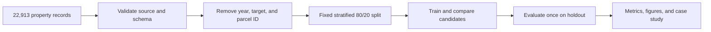
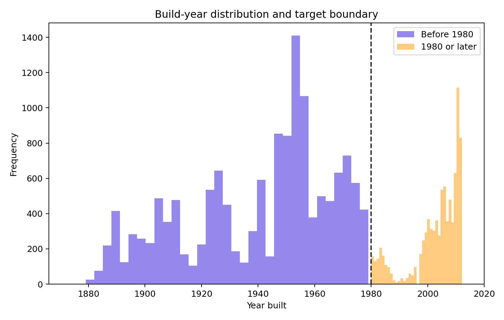
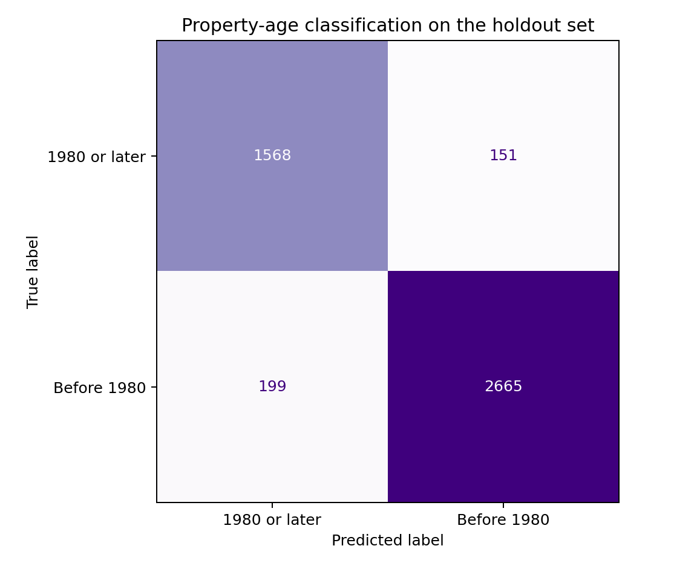

# Data Science Portfolio

[](https://github.com/danieltalbert/data-science-portfolio/actions/workflows/ci.yml)
[](https://danieltalbert.github.io/data-science-portfolio/)
[](LICENSE)

A reproducible portfolio of applied data-science work, centered on clear problem framing, leakage-resistant evaluation, source provenance, and automated verification.


_Visual intuition: the model can inspect structure, condition, quality, garage, and architectural signals, but never the construction year it is asked to infer._

## Start here

| If you want to... | Go to |
| --- | --- |
| See the question and holdout result | [Featured case study](#featured-case-study-property-age-classification) |
| Inspect the figures behind the score | [Read the evidence](#read-the-evidence) |
| Reproduce the analysis | [Reproduce](#reproduce) |
| Review the leakage and data boundaries | [Design decisions](#design-decisions) · [Dataset notes](DATASET.md) |
| Read the web presentation | [Published case study](https://danieltalbert.github.io/data-science-portfolio/) |
| Cite or extend the work | [CITATION.cff](CITATION.cff) · [Contributing](CONTRIBUTING.md) |

## Featured case study: property-age classification

Can structural, condition, quality, garage, architectural, and transaction attributes identify homes built before 1980—without giving the model the build year?

The selected random forest is trained on 80% of 22,913 property records and evaluated on a fixed, stratified 20% holdout. `yrbuilt`, `before1980`, and the parcel identifier are explicitly removed from the model features.

| Holdout metric | Result |
|---|---:|
| Accuracy | 92.36% |
| Balanced accuracy | 92.13% |
| F1 | 0.9384 |
| ROC-AUC | 0.9768 |



### Analysis path



### Read the evidence

| Data boundary | Holdout behavior |
| --- | --- |
|  |  |
| The target boundary creates two interpretable age groups while the build year itself remains excluded from the model. | The confusion matrix makes both kinds of error visible instead of reducing the evaluation to one headline score. |

Read the [complete case study](analysis/property_age_classifier.qmd), inspect the [generated metrics](reports/figures/metrics.json), or open the [published summary](https://danieltalbert.github.io/data-science-portfolio/).

## Reproduce

```powershell
python -m venv .venv
.\.venv\Scripts\Activate.ps1
python -m pip install -r requirements-dev.txt
python -m unittest discover -s tests -v
python -m src.property_age_model --output reports/figures
ruff check .
ruff format --check .
```

The default analysis downloads its CSV directly from the upstream source. To use an existing local copy:

```powershell
python -m src.property_age_model --data data/dwellings_ml.csv
```

## Repository map

```text
analysis/          narrative Quarto case study
src/               reusable data loading, validation, modeling, and reporting
tests/             offline regression tests with synthetic data
reports/figures/   deterministic holdout metrics and visual artifacts
docs/              concise GitHub Pages presentation
DATASET.md         source, scope, licensing, and redistribution notes
```

## Design decisions

- Raw source data is not committed; the upstream repository does not declare a dataset license.
- Direct target leakage (`yrbuilt`) and high-cardinality identity (`parcel`) are excluded in one tested feature boundary.
- Multiple metrics accompany accuracy because the target is moderately imbalanced.
- A random forest is preferred over a marginally more accurate gradient-boosting experiment because it offers a simpler, inspectable feature-importance story for this portfolio case study.
- Report figures and `metrics.json` are generated by the same code exercised in CI.

The code and original documentation in this repository are licensed under the [MIT License](LICENSE). Dataset terms remain with the upstream source described in [DATASET.md](DATASET.md).

For help reproducing the case study, see [SUPPORT.md](SUPPORT.md). Proposed
changes should follow [CONTRIBUTING.md](CONTRIBUTING.md), and sensitive reports
should use the process in [SECURITY.md](SECURITY.md).
